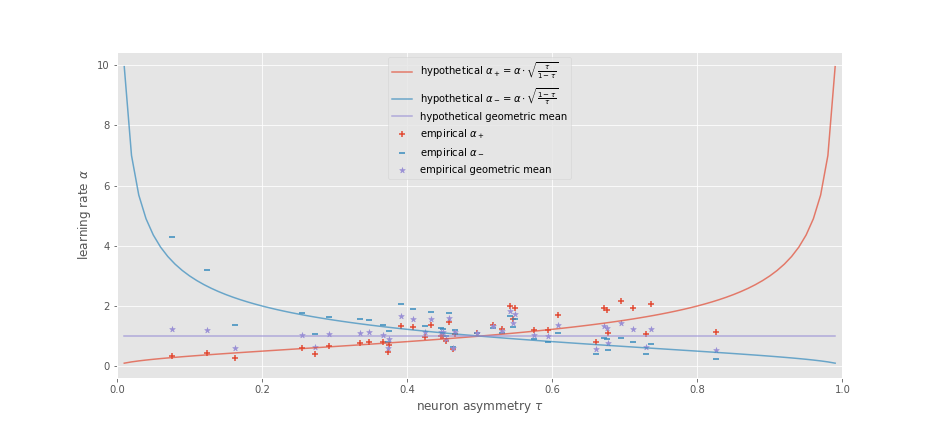

# Expectile-based Distributional Reinforcement Learning in the Brain

This repository contains some code and notebooks from my exploration
of expectiles, distributional reinforcement learning, and the brain.

Made with :purple_heart: by Matt, but, I must say, I really don't
feel purple love for jupyter notebooks. More like red fiery rage.

See also [my expectiles repo](https://github.com/matomatical/expectiles)
for an implementation of my method for efficiently computing sample
expectiles.

## Highlights:

* `LearningRateStability.ipynb` for a tutorial on online computation
  of means and expectiles, including a hypothetical asymmetric rate
  setting scheme which is probably optimal and seems to match what
  *mice neurons* like to do:
  
  

  What a fit!---I should learn how to do error bars and regression
  tests. But not today!
  
* `Imputation-Direct.ipynb` and `Imputation-PolyLogit` for some attempts at
  an alternative to DeepMind's optimisation-based imputation strategy,
  which should be vastly more computationally efficient but are still having
  some trouble with accuracy and stability
  (see `Imputation-Optimisation.ipynb` for my reproduction of their method),
  and `ImputationStability.ipynb` for some demonstrations of these methods.

* `NamingAsymmetries.ipynb` for some thoughts about a good term for this tau
  thing floating around---'attitude'? 'outlook'?---and on how it should be
  scaled---logitally?

## Where to from here?

Some more questions:

* Can the direct imputation method lead to a nicer 'decoding' demonstration
  using the neural data? It seems the optimisation-based method is actually
  a lot more robust to this kind of noisy data.

* Can the updates from 'learning rate stability' lead to an efficient
  EDRL algorithm? I'll try in `CoatPullover.ipynb` (replication/extension
  of DeepMind's 'Bird Dog' experiment) and then try something more serious
  (Cartpole? Mountain Car? Pong? Parkour?)

* The plots in 'aggregate RPEs' suggest some kind of (measurable?)
  nonlinear response from an ensemble of asymmetrically tuned
  dopamine neurons to rewards; is there any empirical evidence of this?
  Are there limits to the nonlinearity, say, at the lower end due to
  the negative signal being incodes as an inhibition of baseline response?

Other imputation strategies

* Apparently there's a DistRL algorithm based on mixtures of gaussians.
  Since, according to Richard, gaussians are common in neurobiology, this
  could be worth looking at on the basis of its biological plausibility.

* Is Maximum Entropy Inference applicable? I tried but got to a dead end
  in `Imputation-MaxEnt.ipynb`, but it may be recoverable.
